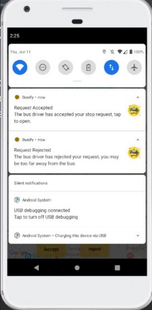
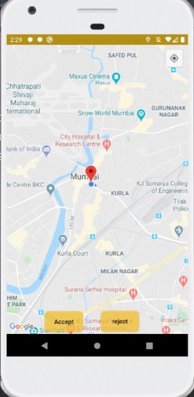
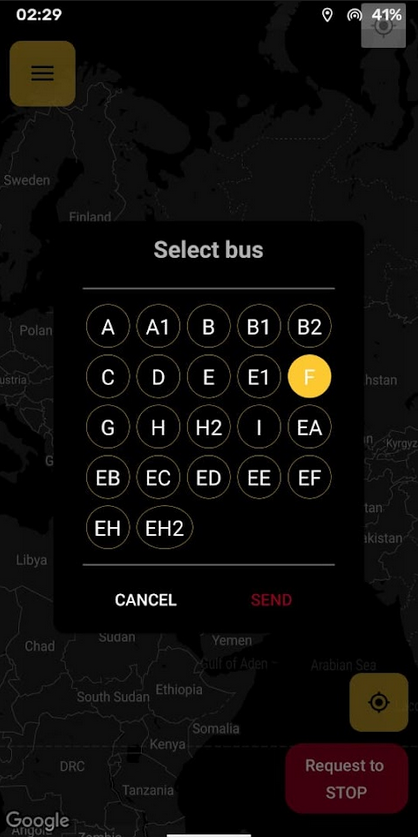

## About The Project
A native android application to help students track and manage their college bus timings/route.
 

 

### Features

    - Track the real time location of their bus
    - Send a STOP request to drivers 
    - View other buses on your route
    - Firebase authentication for passengers and drivers

 
### Built With

* [Android Studio](https://developer.android.com/studio)
* [Firebase](https://firebase.google.com/)

<!-- CONTRIBUTING -->
## Contributing

We are looking for ways to improve this project through optimizations or new features. Here's how you can contribute:

1. Fork the Project
2. Create your Feature Branch (`git checkout -b feature/AmazingFeature`)
3. Commit your Changes (`git commit -m 'Add some AmazingFeature'`)
4. Push to the Branch (`git push origin feature/AmazingFeature`)
5. Open a Pull Request

